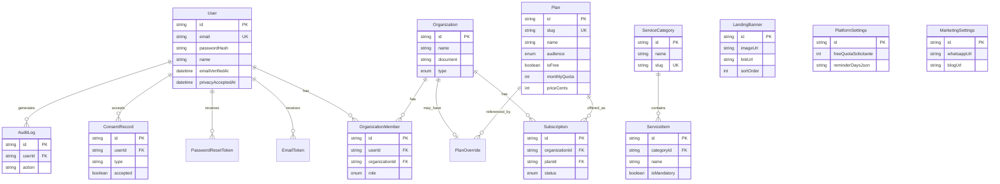

# Diagrama ER — Dia 1 (CotaCondo)

```mermaid
erDiagram
  User ||--o{ OrganizationMember : has
  Organization ||--o{ OrganizationMember : has
  Organization ||--o{ Subscription : has
  Plan ||--o{ Subscription : offered_as
  Organization ||--o| PlanOverride : may_have
  Plan ||--o{ PlanOverride : referenced_by
  ServiceCategory ||--o{ ServiceItem : contains
  User ||--o{ EmailToken : receives
  User ||--o{ PasswordResetToken : receives
  User ||--o{ ConsentRecord : accepts
  User ||--o{ AuditLog : generates

  User {
    string id PK
    string email UK
    string passwordHash
    string name
    datetime emailVerifiedAt
    datetime privacyAcceptedAt
  }

  Organization {
    string id PK
    string name
    string document
    enum type
  }

  OrganizationMember {
    string id PK
    string userId FK
    string organizationId FK
    enum role
  }

  Plan {
    string id PK
    string slug UK
    string name
    enum audience
    boolean isFree
    int monthlyQuota
    int priceCents
  }

  Subscription {
    string id PK
    string organizationId FK
    string planId FK
    enum status
  }

  ServiceCategory {
    string id PK
    string name
    string slug UK
  }

  ServiceItem {
    string id PK
    string categoryId FK
    string name
    boolean isMandatory
  }

  LandingBanner {
    string id PK
    string imageUrl
    string linkUrl
    int sortOrder
  }

  PlatformSettings {
    string id PK
    int freeQuotaSolicitante
    string reminderDaysJson
  }

  MarketingSettings {
    string id PK
    string whatsappUrl
    string blogUrl
  }

  AuditLog {
    string id PK
    string userId FK
    string action
  }

  ConsentRecord {
    string id PK
    string userId FK
    string type
    boolean accepted
  }
```

Gerado no Dia 1 — modelo de domínio em `prisma/schema.prisma` (referência) e BaaS oficial **Firebase / Firestore**.
